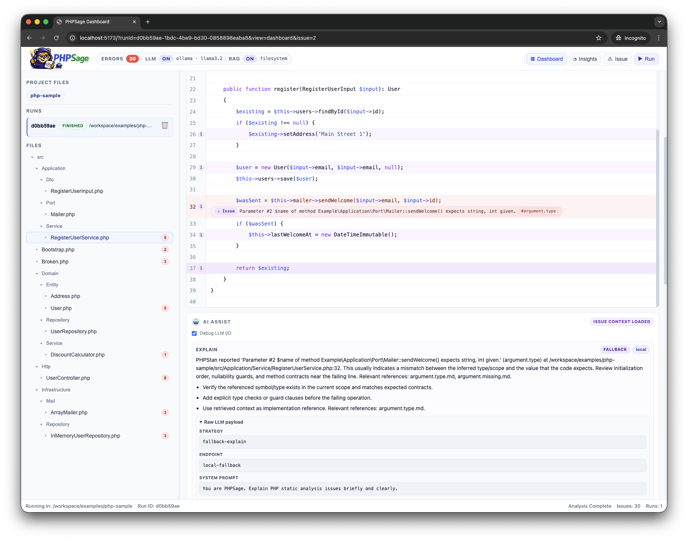

<h1 align="center">
  
</h1>

PHPSage es una herramienta web orientada al desarrollador PHP que parte de la salida de PHPStan y la enriquece con contexto operativo, navegación sobre el código y asistencia de IA para comprender mejor cada issue y evaluar posibles soluciones.



## Índice de contenido

- [a. Descripción general del proyecto](#a-descripción-general-del-proyecto)
- [b. Stack tecnológico utilizado](#b-stack-tecnológico-utilizado)
- [c. Instalación y ejecución](#c-instalación-y-ejecución)
  - [Demo](#demo)
  - [Local](#local)
    - [Requisitos](#requisitos)
    - [Arranque rápido](#arranque-rápido)
    - [Comandos locales útiles](#comandos-locales-útiles)
    - [Ejecutar un análisis](#ejecutar-un-análisis)
  - [Remoto](#remoto)
    - [Provisionar infraestructura](#provisionar-infraestructura)
    - [Desplegar la aplicación en el cloud de Hetzner](#desplegar-la-aplicación-en-el-cloud-de-hetzner)
    - [Requisitos mínimos para remoto](#requisitos-mínimos-para-remoto)
    - [Ejecución remota manual](#ejecución-remota-manual)
    - [Cómo probarlo en remoto](#cómo-probarlo-en-remoto)
  - [Variables de configuración](#variables-de-configuración)
- [d. Estructura del proyecto](#d-estructura-del-proyecto)
- [e. Funcionalidades principales](#e-funcionalidades-principales)
- [f. Comandos más habituales](#f-comandos-más-habituales)
- [g. Documentación complementaria](#g-documentación-complementaria)

## a. Descripción general del proyecto

PHPSage está diseñado para convertir la salida estática de PHPStan en una experiencia de análisis más útil, navegable y accionable para el desarrollador PHP.

Para ello, el proyecto agrupa en un mismo monorepo las piezas necesarias para trabajar con análisis estático de PHP de forma operativa:

- una CLI para lanzar análisis y tareas de ingest de RAG
- una API que gestiona el ciclo de vida de los runs y la integración con IA
- una UI web para navegar logs, issues, archivos y código fuente
- un paquete compartido con contratos y utilidades comunes
- una capa de infraestructura como código para publicar y operar el entorno remoto de demostración

El flujo principal es este:

1. Se levanta la plataforma en local o en remoto con Docker Compose.
2. Se ejecuta un análisis desde la CLI.
3. El server persiste el run y expone logs, resultados y ficheros asociados.
4. La UI permite inspeccionar el run y, si la IA está activa, pedir explicaciones o sugerencias de fix.

Comandos principales del producto:

- `phpsage app`
- `phpsage phpstan analyse <path>`
- `phpsage rag ingest`

## b. Stack tecnológico utilizado

### Aplicación

- Node.js
- TypeScript
- npm workspaces
- React
- Vite

### Backend y herramientas

- API HTTP en Node.js
- CLI propia para análisis y tareas de RAG
- paquete compartido para contratos, parsing y utilidades

### IA y RAG

- Ollama como proveedor local opcional
- OpenAI como proveedor remoto opcional
- Qdrant como backend vectorial opcional
- filesystem como backend simple de RAG sin vector database

### Infraestructura y operación

- Docker
- Docker Compose
- Makefile para flujos operativos
- Pulumi + TypeScript en `infra/`
- Hetzner Cloud para servidor
- Cloudflare para DNS y acceso público
- Traefik para entrada HTTPS en remoto

## c. Instalación y ejecución

## Demo

PHPSage dispone de una instancia desplegada y accesible para revisión:

- `https://phpsage.nopingnogain.com`

La documentación pública del proyecto está disponible en:

- `https://thebrokenbrain.github.io/phpsage/`

Ese entorno debe considerarse la demostración principal del proyecto. No es una URL prevista para el futuro ni un entorno teórico: es una web ya publicada, accesible por HTTPS y operativa sobre el cloud de Hetzner.

Para un profesor o revisor, ese es el punto de entrada más directo para comprobar que el sistema está efectivamente desplegado y funcionando fuera del entorno local.

Además, está conectado con OpenAI para validar el comportamiento real de la capa IA en un entorno externo.

El acceso a esa URL está protegido con Cloudflare Zero Trust. Para entrar se solicita autenticación por correo y se envía un código OTP de un solo uso al email autorizado.

En el estado actual, el acceso se realiza con el correo `mouredev@gmail.com`, que recibe el código de verificación necesario para completar la entrada.

Se ha protegido de esta forma porque esa instancia está conectada a una cuenta de OpenAI con crédito disponible para probar un modelo grande. Zero Trust evita dejar expuesto públicamente un entorno que consume recursos reales de proveedor.

## Local

### Requisitos

- Docker Desktop
- Docker Compose v2
- Make

Para levantar PHPSage en local no necesitas instalar Node.js ni dependencias del proyecto en el host.

La documentación de MkDocs se ejecuta aparte y no forma parte del stack principal definido en `docker-compose.yml`.

La versión publicada de esta documentación puede servirse desde GitHub Pages, separada del despliegue funcional de la demo.

### Arranque rápido

Desde la raíz del proyecto:

```bash
make local/up
```

Ese comando:

- crea `.env` a partir de `.env.example` si todavía no existe
- construye las imágenes necesarias
- arranca el stack local en segundo plano

Servicios disponibles en local:

- UI: `http://localhost:5173`
- API: `http://localhost:8080`
- Swagger UI: `http://localhost:8081`
- Qdrant: `http://localhost:6333`
- Ollama: `http://localhost:11434`

### Comandos locales útiles

```bash
make local/up
make local/reset
make local/down
make local/destroy
make docs/build
```

Uso recomendado:

- `make local/up`: primer arranque o volver a levantar el stack
- `make local/reset`: reiniciar el stack desde un estado limpio sin tocar volúmenes
- `make local/down`: parar los contenedores
- `make local/destroy`: borrar contenedores, redes, volúmenes e imágenes construidas por Compose

### Ejecutar un análisis

Con el stack levantado, puedes lanzar un análisis desde la CLI en contenedor:

```bash
docker compose run --rm --build phpsage-cli phpsage phpstan analyse /workspace/examples/php-sample --docker --no-open
```

Comprobaciones rápidas:

```bash
curl http://localhost:8080/healthz
curl http://localhost:8080/api/ai/health
```

## Remoto

El flujo remoto está separado en dos fases: provisionar infraestructura y desplegar la aplicación en el cloud de Hetzner.

### Provisionar infraestructura

La infraestructura vive en `infra/` y se gestiona con Pulumi. Desde la raíz del repositorio, el entrypoint operativo es:

```bash
make infra/up
```

También están disponibles:

```bash
make infra/preview
make infra/destroy
```

Ese flujo usa un contenedor de tooling y el archivo `infra/.env`.

### Desplegar la aplicación en el cloud de Hetzner

Una vez provisionado el host, el despliegue se hace por SSH:

```bash
make deploy/app
```

Si quieres encadenar el provisionado y el despliegue:

```bash
make deploy/all
```

Qué hace el despliegue:

- obtiene la IP pública desde Pulumi si no la indicas manualmente
- conecta por SSH al servidor
- sincroniza el código en `/opt/phpsage`
- copia el `.env` local al servidor
- copia certificados TLS si están referenciados en `.env`
- levanta Docker Compose remoto con la configuración de servidor

### Requisitos mínimos para remoto

- `infra/.env` configurado con credenciales de Pulumi, Hetzner y Cloudflare
- `.env` de la aplicación configurado en la raíz del proyecto
- secretos y credenciales de proveedor correctamente configurados antes de arrancar o probar la capa IA
- acceso SSH válido al servidor
- repositorio accesible desde el host remoto o configuración explícita para desplegar desde el árbol local

En la práctica, si quieres que el entorno remoto funcione con OpenAI, debes tener definidos como mínimo:

- `AI_PROVIDER=openai`
- `OPENAI_API_KEY`
- `OPENAI_MODEL`
- cualquier otra variable de red o endpoint que aplique a tu proveedor

### Ejecución remota manual

Si necesitas operar manualmente en el servidor, la combinación esperada es:

```bash
docker compose -f docker-compose.yml -f docker-compose.server.yml up --build -d
```

En remoto, Traefik expone la aplicación por `80` y `443` y enruta web, API y documentación bajo el mismo host.

### Cómo probarlo en remoto

El sitio ideal para validar el comportamiento desplegado es:

- `https://phpsage.nopingnogain.com`

Ese entorno debe tomarse como referencia para comprobar:

- que la UI carga correctamente en HTTPS
- que el acceso queda filtrado por Cloudflare Zero Trust mediante OTP por correo
- que los runs siguen siendo navegables
- que la API responde bajo el mismo host
- que la integración con OpenAI está operativa

Si el objetivo es demostrar el estado real del proyecto sin levantar nada en local, esa es la URL que conviene usar primero.

## Variables de configuración

El proyecto puede arrancar en local solo con el contenido base de `.env.example`. Estas son las variables mas relevantes:

| Variable | Uso | Valor habitual |
| --- | --- | --- |
| `AI_PROVIDER` | Selecciona el proveedor de IA | `ollama` u `openai` |
| `OLLAMA_BASE_URL` | URL de Ollama | `http://ollama:11434` |
| `OLLAMA_MODEL` | Modelo por defecto en Ollama | `llama3.2` |
| `OPENAI_BASE_URL` | Endpoint base para OpenAI compatible | `https://api.openai.com` |
| `OPENAI_API_KEY` | Credencial para OpenAI | obligatorio si usas OpenAI |
| `OPENAI_MODEL` | Modelo usado con OpenAI | `gpt-5.4` |
| `AI_HEALTH_TIMEOUT_MS` | Timeout de probes de salud IA | `5000` |
| `AI_DEBUG_LLM_IO` | Expone payloads LLM en respuestas de debug | `true` o `false` |
| `AI_RAG_BACKEND` | Backend de recuperación de contexto | `filesystem` o `qdrant` |
| `QDRANT_URL` | URL de Qdrant | `http://qdrant:6333` |
| `QDRANT_COLLECTION` | Coleccion vectorial | `phpsage-rag` |
| `AI_INGEST_DEFAULT_TARGET` | Ruta por defecto para ingest | `/workspace/docs/phpstan` |
| `AI_RAG_DIRECTORY` | Directorio documental en modo filesystem | `docs/phpstan` |
| `AI_RAG_TOP_K` | Número de fragmentos recuperados | `3` |
| `AI_RAG_AUTO_INGEST_ON_BOOT` | Ejecuta ingest automática al arrancar | `true` o `false` |
| `PHPSAGE_PUBLIC_HOST` | Dominio público en remoto | dominio final |
| `PHPSAGE_TLS_CERT_PATH` | Certificado TLS usado por Traefik | ruta del certificado |
| `PHPSAGE_TLS_KEY_PATH` | Clave privada TLS usada por Traefik | ruta de la clave |
| `PHPSAGE_DEPLOY_SOURCE` | Fuente del despliegue remoto | `git` o `local` |

Notas útiles:

- si vas a trabajar solo en local, normalmente basta con dejar `AI_PROVIDER=ollama`
- si usas OpenAI, cambia `AI_PROVIDER=openai` y define al menos `OPENAI_API_KEY` y `OPENAI_MODEL`
- las variables sensibles y secretos nunca deben quedar sin configurar en remoto si quieres probar IA real
- para despliegue HTTPS con Cloudflare Full strict, necesitas `PHPSAGE_TLS_CERT_PATH` y `PHPSAGE_TLS_KEY_PATH`

## d. Estructura del proyecto

```text
phpsage/
  apps/
    cli/
    server/
    web/
  certificates/
  data/
    ai/
    runs/
  deploy/
    traefik/
  docs/
  examples/
  infra/
  packages/
    shared/
  scripts/
  .env.example
  docker-compose.yml
  docker-compose.docs.yml
  docker-compose.server.yml
  Dockerfile
  Makefile
  mkdocs.yml
  package.json
```

Descripción de carpetas y ficheros principales:

- `apps/cli/`: CLI de PHPSage. Desde aquí se lanzan análisis, modo app e ingest de RAG.
- `apps/server/`: API HTTP y coordinación del ciclo de vida de runs, lectura de source y endpoints de IA.
- `apps/web/`: interfaz React/Vite para inspeccionar runs, issues, archivos y resultados de IA.
- `packages/shared/`: tipos compartidos, contratos serializables, parser de salida y utilidades comunes.
- `infra/`: infraestructura como código con Pulumi para Hetzner, Cloudflare, firewall, DNS y bootstrap base.
- `deploy/traefik/`: configuración de Traefik usada en despliegue remoto.
- `docs/`: documentación funcional, API, UX y guías operativas.
- `examples/`: proyectos PHP de ejemplo para smoke tests y validaciones manuales.
- `scripts/`: automatizaciones auxiliares, smokes, reindexado y despliegue.
- `data/runs/`: persistencia local de runs y resultados de análisis.
- `data/ai/`: datos auxiliares relacionados con ingest y almacenamiento IA.
- `certificates/`: certificados TLS locales para despliegues remotos con HTTPS. Debe mantenerse fuera de git.
- `.env.example`: plantilla base de configuración de la aplicación.
- `docker-compose.yml`: stack local principal para desarrollo y validación.
- `docker-compose.docs.yml`: stack aislado para servir y construir la documentación con MkDocs.
- `docker-compose.server.yml`: override para exponer la aplicacion en remoto mediante Traefik.
- `Makefile`: entrypoints operativos para local, infraestructura y despliegue.
- `mkdocs.yml`: configuración de navegación y build de la documentación técnica.

## e. Funcionalidades principales

- Ejecución de análisis PHPStan desde CLI.
- Persistencia del historial de runs en JSON.
- Streaming de logs y estado del run en vivo.
- UI web para navegar runs, issues, archivos y código fuente.
- API para listar runs, consultar detalle, leer source y explorar ficheros asociados.
- Capa IA opcional para explicar issues y proponer fixes.
- RAG con backend filesystem o Qdrant.
- Ingest de documentación para enriquecer el contexto de IA.
- Despliegue remoto automatizado sobre infraestructura provisionada con Pulumi.

## f. Comandos más habituales

```bash
make local/up
docker compose run --rm --build phpsage-cli phpsage phpstan analyse /workspace/examples/php-sample --docker --no-open
make infra/up
make deploy/app
```

## g. Documentación complementaria

- https://thebrokenbrain.github.io/phpsage/