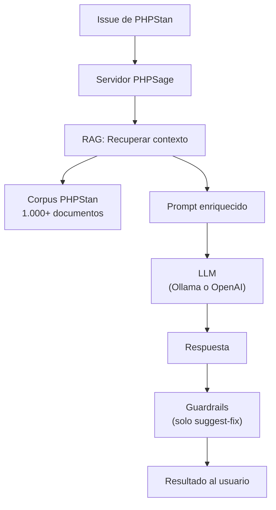

# IA y RAG

## Visión general

La capa de IA de PHPSage es una funcionalidad **opcional** que enriquece la experiencia del análisis estático. Sin IA, PHPSage sigue siendo funcional para navegar runs, issues, archivos y código fuente. Con IA, el sistema puede explicar errores y proponer correcciones.



## Funcionalidades de IA

### Explain

El endpoint `POST /api/ai/explain` recibe un issue de PHPStan y genera una explicación. El flujo es:

1. El servidor recibe el issue (mensaje, identificador, archivo, línea, snippet de código).
2. El sistema RAG recupera los fragmentos documentales más relevantes del corpus PHPStan.
3. Se construye un prompt con el issue y el contexto documental.
4. Se envía al LLM configurado.
5. La respuesta incluye una explicación y recomendaciones.

Si el LLM no está disponible, el sistema tiene un mecanismo de **fallback** que devuelve una respuesta básica indicando que la IA no está operativa.

### Suggest Fix

El endpoint `POST /api/ai/suggest-fix` funciona de forma similar a explain, pero en lugar de una explicación, genera un **diff concreto** con la corrección propuesta.

La diferencia clave es que el diff pasa por un sistema de **guardrails** antes de llegar al usuario:

- Se verifica que el diff sea aplicable sobre el código fuente original.
- Se ejecutan validaciones heurísticas y comprobaciones de sintaxis (`php -l`).
- Si el diff no pasa las validaciones, se devuelve `proposedDiff: null` junto con un `rejectedReason` que explica por qué se rechazó el parche.

Este diseño es intencionalmente conservador: es preferible no mostrar un fix a mostrar uno defectuoso.

## Corpus documental

El directorio `docs/phpstan/` contiene más de 1.000 documentos en formato Markdown sobre errores de PHPStan. Cada documento sigue una estructura consistente:

- **Front matter YAML** con el título del error y si es ignorable.
- **Ejemplo de código** que reproduce el error.
- **Explicación** de por qué PHPStan lo reporta.
- **Correcciones sugeridas** con diffs de ejemplo.

Este corpus es la base del sistema RAG. Cuando un usuario pide explicar un issue, el sistema busca en este corpus los fragmentos más relevantes y los incluye como contexto en el prompt al LLM.

La base documental parte de la documentación oficial de errores de PHPStan, disponible en [phpstan/phpstan/tree/2.2.x/website/errors](https://github.com/phpstan/phpstan/tree/2.2.x/website/errors).

## Backends de RAG

### Filesystem

El modo por defecto. Busca documentos relevantes por coincidencia de identificadores de error. No requiere base de datos vectorial.

Configuración:

```
AI_RAG_BACKEND=filesystem
AI_RAG_DIRECTORY=docs/phpstan
```

### Qdrant

Modo avanzado con base de datos vectorial. Permite búsqueda semántica sobre el corpus, lo que puede encontrar documentos relevantes incluso cuando el identificador del error no coincide exactamente.

Configuración:

```
AI_RAG_BACKEND=qdrant
QDRANT_URL=http://qdrant:6333
QDRANT_COLLECTION=phpsage-rag
```

!!! info "Ingesta"
    Antes de que el RAG funcione, el corpus debe ser ingestado. Esto puede hacerse:

    - Automáticamente al arrancar el servidor (si `AI_RAG_AUTO_INGEST_ON_BOOT=true`).
    - Manualmente con `phpsage rag ingest` o `POST /api/ai/ingest`.

    En modo Qdrant, la ingesta se salta si el fingerprint del corpus no ha cambiado desde la última ingesta exitosa.

## Proveedores de IA

### Ollama

Proveedor local que ejecuta modelos de lenguaje en la propia máquina. Se incluye como servicio en el Docker Compose de desarrollo.

- No requiere API key ni conexión a internet.
- Útil para desarrollo y pruebas.
- Modelo por defecto: `llama3.2`.

### OpenAI

Proveedor remoto que usa la API de OpenAI.

- Requiere `OPENAI_API_KEY`.
- Usado en la instancia de demo (`phpsage.nopingnogain.com`).
- Modelo por defecto: `gpt-4o-mini`.

## Respuestas de IA

Todas las respuestas de los endpoints de IA incluyen metadatos sobre la fuente:

| Campo | Descripción |
|---|---|
| `source` | `"llm"` si el LLM respondió, `"fallback"` si se usó el mecanismo de respaldo |
| `provider` | Proveedor que generó la respuesta |
| `fallbackReason` | Motivo del fallback, si aplica |
| `usage` | Tokens consumidos (modelo, input, output, total) |
| `debug` | Payload de debug (si `AI_DEBUG_LLM_IO=true`): estrategia, endpoint, prompts, request body |

Para suggest-fix, se incluyen además:

| Campo | Descripción |
|---|---|
| `proposedDiff` | Diff propuesto, o `null` si fue rechazado |
| `rejectedReason` | Motivo del rechazo del parche, si aplica |
