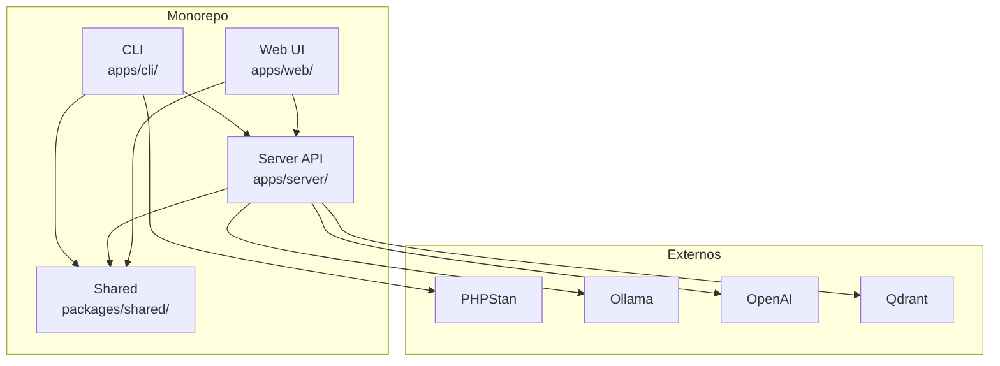
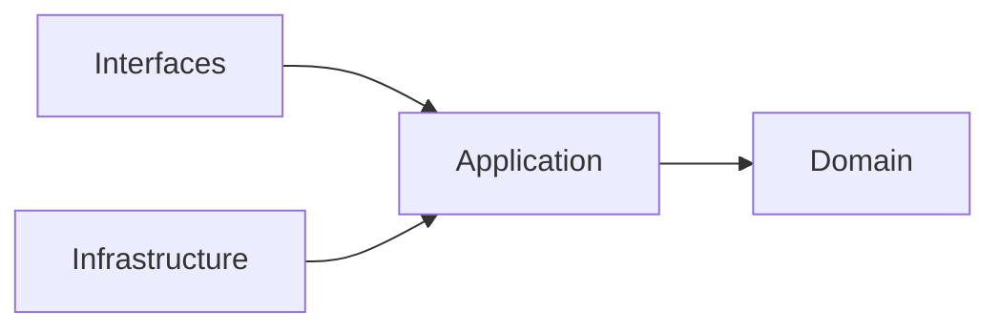
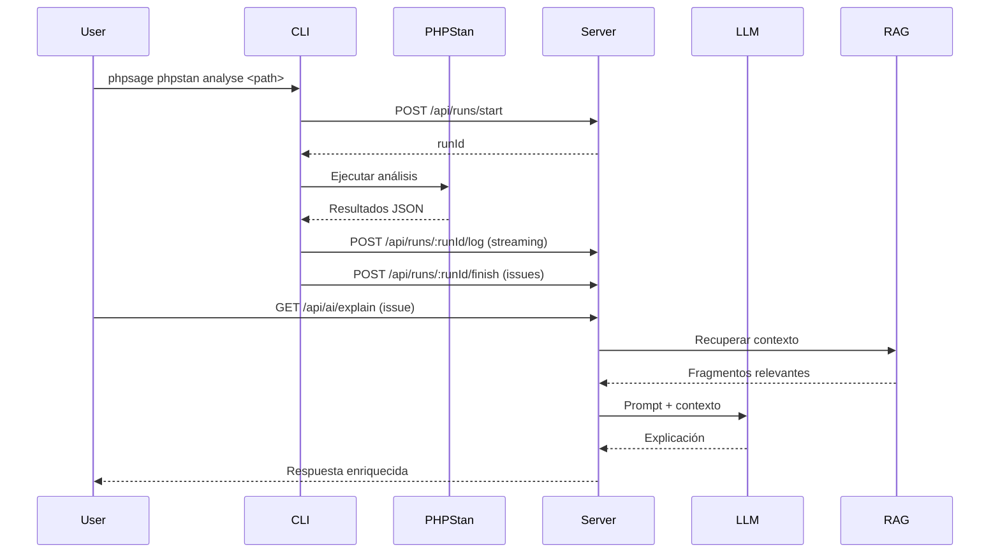

# Arquitectura

## Visión general

PHPSage está organizado como un **monorepo TypeScript** gestionado con npm workspaces. Los componentes del producto (CLI, servidor, web y paquetes compartidos) conviven en el mismo repositorio. Además, el repositorio incluye automatización de despliegue y documentación para la demo pública.

## Arquitectura interna del servidor

El servidor sigue una arquitectura limpia (Clean Architecture) con separación estricta de capas:

| Capa | Directorio | Responsabilidad |
|---|---|---|
| **Domain** | `src/domain/` | Reglas de negocio puras. Modelo `Run`. |
| **Application** | `src/application/` | Casos de uso y definición de puertos. Servicios de IA (explain, suggest-fix, ingest, RAG context). |
| **Infrastructure** | `src/infrastructure/` | Adaptadores concretos: repositorios en filesystem, clientes LLM (Ollama, OpenAI), almacén vectorial (Qdrant), patch guard. |
| **Interfaces** | `src/interfaces/` | Servidor HTTP. Orquesta los casos de uso sin contener lógica de dominio. |

La **regla de dependencia** apunta siempre hacia dentro: las capas externas dependen de las internas, pero nunca al revés. Las capas internas definen puertos (interfaces) que las capas externas implementan.

## Flujo de un análisis completo

## Principios de diseño

Los principios operativos del proyecto están documentados en `AGENTS.md`:

- **Iteraciones cortas** con resultados verificables.
- **WIP máximo**: una iteración activa a la vez.
- **Corrección observable primero**, refinamientos después.
- **Simplicidad**: evitar complejidad accidental.
- **Documentación sincronizada**: cada cambio funcional, de API o de UX se documenta en la misma iteración.
