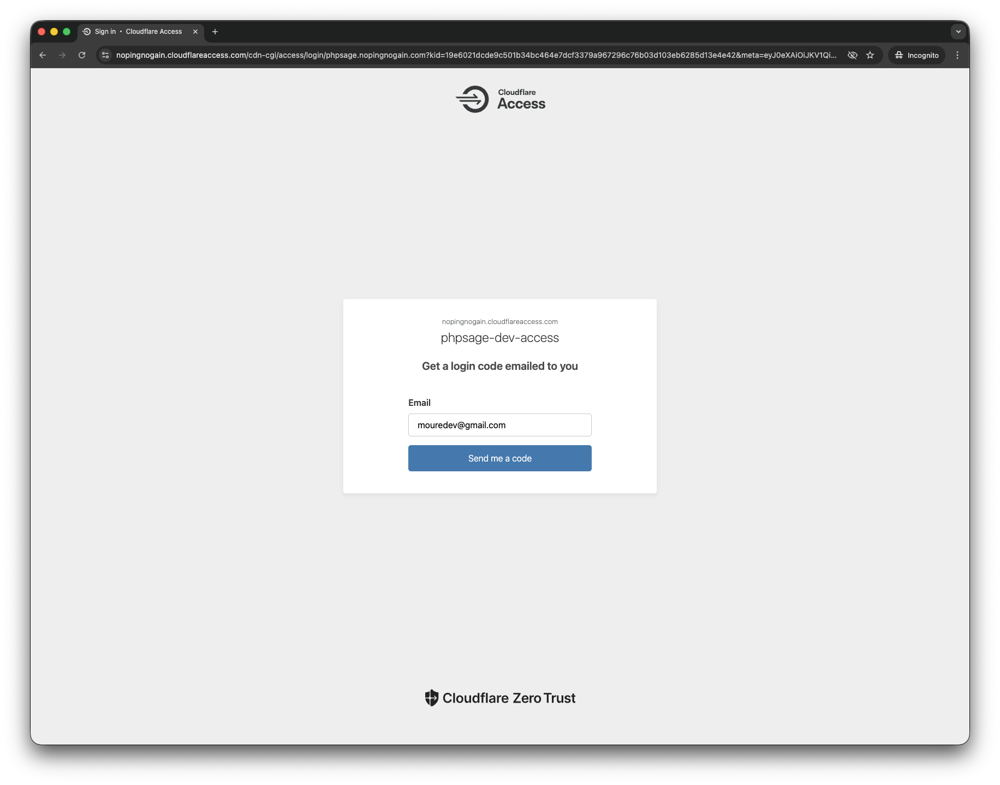
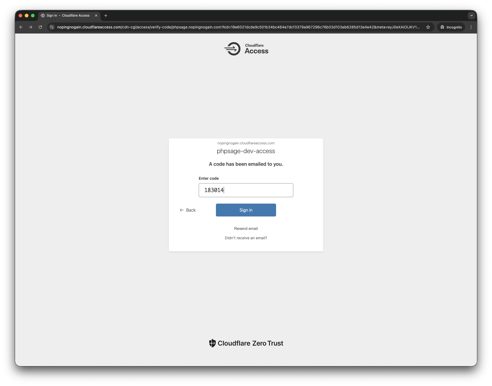

# Demo

PHPSage dispone de una instancia desplegada y accesible para revisión.

## URL de acceso

- `https://phpsage.nopingnogain.com`

## Autenticación

El acceso está protegido con Cloudflare Zero Trust mediante autenticación por correo con OTP.

Para acceder, debes indicar el correo `mouredev@gmail.com`, que es donde llegará el código de acceso.

## Qué puedes comprobar

Este entorno está conectado con OpenAI y carga el proyecto PHP de ejemplo ubicado en `examples/php-sample`, por lo que es la forma más directa de validar que el sistema funciona en un entorno real sin necesidad de levantar nada en local.