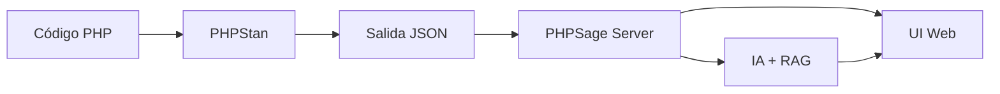

# Visión general

## Qué es PHPSage

PHPSage es una plataforma web que parte de la salida de **PHPStan** —la herramienta de análisis estático más utilizada en el ecosistema PHP— y la enriquece con tres capas adicionales:

1. **Navegación estructurada**: una interfaz web donde los resultados del análisis se presentan organizados por archivo, por tipo de error y con acceso directo al código fuente afectado.
2. **Asistencia de IA**: un sistema que, dado un issue concreto detectado por PHPStan, genera una explicación clara del problema y propone una corrección concreta en forma de diff.
3. **Contexto documental (RAG)**: un corpus de más de 1.000 documentos sobre errores de PHPStan, construido a partir de la documentación oficial de errores de PHPStan, que se inyecta como contexto al modelo de IA para que las respuestas sean más precisas y específicas.

## Qué problema resuelve

Cuando un desarrollador PHP ejecuta PHPStan sobre un proyecto, el resultado es una lista de errores en texto plano o JSON. Cada error indica un archivo, una línea y un mensaje técnico.

Para proyectos pequeños, esta salida es manejable. Pero en proyectos reales, con cientos de errores, la experiencia se complica:

- **Los mensajes son técnicos y densos**: PHPStan reporta errores con un lenguaje preciso pero a veces difícil de interpretar sin contexto adicional. Un desarrollador junior o alguien que trabaja con un código heredado puede necesitar buscar documentación extra para entender qué significa cada error.
- **No hay navegación**: la salida es una lista plana. No hay forma directa de agrupar errores por archivo, de ver el código fuente afectado, o de filtrar por tipo de issue.
- **No hay orientación operativa**: PHPStan dice qué está mal, pero no explica por qué ni sugiere cómo arreglarlo. La decisión de cómo resolver cada error queda completamente en manos del desarrollador.

PHPSage intenta resolver estas tres limitaciones ofreciendo una capa intermedia entre PHPStan y el desarrollador.

## Flujo principal

El flujo de trabajo de PHPSage es el siguiente:



1. Se levanta la plataforma en local (o en remoto) con Docker Compose.
2. Se ejecuta un análisis desde la CLI: `phpsage phpstan analyse <path>`.
3. El servidor persiste el run y expone los resultados, logs y archivos asociados a través de la API.
4. La interfaz web permite inspeccionar el run: navegar issues, ver código fuente, filtrar por archivo.
5. Si la IA está activa, se puede pedir al sistema que explique un issue o sugiera un fix concreto.

## Comandos principales

PHPSage expone tres comandos principales a través de su CLI:

En entorno Docker, se ejecutan a través del contenedor `phpsage-cli` con este patrón:

```bash
docker compose run --rm --build phpsage-cli phpsage <comando>
```

| Comando | Descripción |
|---|---|
| `phpsage app` | Levanta el servidor y la UI |
| `phpsage phpstan analyse <path>` | Lanza un análisis de PHPStan sobre el path indicado |
| `phpsage rag ingest` | Ejecuta la ingesta del corpus documental para el sistema RAG |

## Stack tecnológico

| Capa | Tecnología |
|---|---|
| Lenguaje | TypeScript / Node.js |
| Frontend | React + Vite |
| Backend | API HTTP en Node.js |
| Gestión de paquetes | npm workspaces (monorepo) |
| IA | OpenAI (remoto) u Ollama (local) |
| RAG | Filesystem o Qdrant como backend vectorial |
| Contenedores | Docker + Docker Compose |
| Infraestructura | Pulumi + Hetzner Cloud + Cloudflare |
| Proxy inverso | Traefik (en despliegue remoto) |
